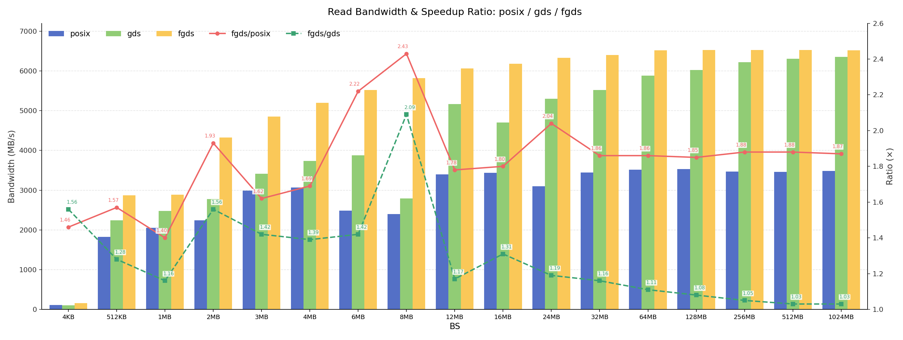
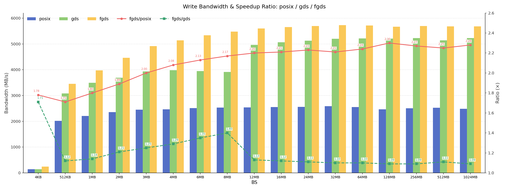
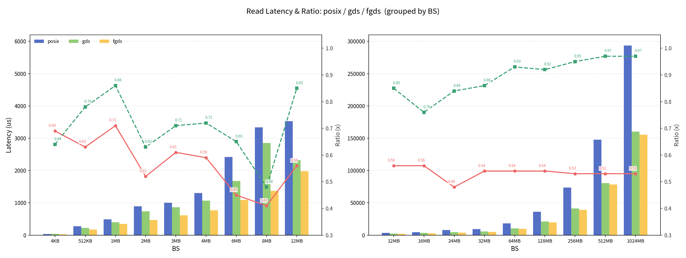
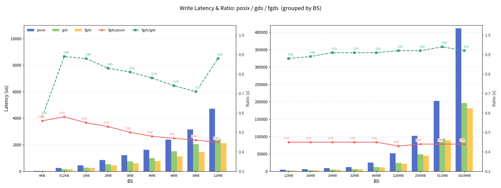

# FGDS:Fast GPUDirect Storage

English | [中文](./docs/README_CN.md)

FGDS is an optimized alternative to GDS, featuring higher performance, easier deployment, and better application compatibility. [GDS](https://docs.nvidia.com/gpudirect-storage/) (GPUDirect Storage) is a technology developed by NVIDIA that provides a direct data path between storage devices (like high-speed NVMe SSDs) and GPU memory.

Cloned from [Phoenix](https://github.com/nicexlab/phoenix) at commit [`798208d`](https://github.com/nicexlab/phoenix/tree/798208d720b234954fef433b306a485093350e2a), FGDS has undergone extensive optimizations and bug fixes, and is under active development. Welcome to use it and share your feedback—we will respond promptly, and contributions of any kind are welcome.

## Highlights

- **High Performance**
    - Eliminating the overhead of phony buffers incurred by traditional GDS, thanks to Phoenix
    - Based on io_uring, FGDS further significantly boosts disk read and write performance, with read performance improved by up to 115% and write performance by up to 40%
- **Easier Deployment**
    - Eliminating the need to install the MLNX_OFED kernel driver suite
    - Added support for users to explicitly specify a subset of GPUs to use
- **Better Application Compatibility**
    - Introduced Python API
    - Added the LMCache backend, enabling vLLM to offload KV cache via LMCache using FGDS, which accelerates inference performance
    - Added PyTorch APIs, compatible with the PyTorch GDS API, to improve the performance of reading and writing checkpoints during LLM training
    - Featuring (nearly) POSIX-compliant APIs
- **Fixes**
    - Kernel module loading failures
    - Host crashes and reboots when GPUs read from or write to NVMe drives in certain environments
    - Resource leak during kernel module loading
    - Enhanced test code and performance benchmarking programs

## Example

The snippet below shows the main FGDS APIs.

Except for GPU buffer registration (`fgds_regmem` / `fgds_deregmem`), file I/O is done with standard POSIX `pread` / `pwrite` on the registered mapping (`target_addr`).

Error checks and setup details are omitted for brevity; see [example/example.cc](./example/example.cc) for a complete runnable program.

```cpp
int device_id = 0;
size_t io_size = 4 * 1024 * 1024;  // 4MB
void *gpu_buffer = nullptr, *target_addr = nullptr;

int fd = open("/data/test.bin", O_CREAT | O_RDWR | O_DIRECT, 0644);

fgds_open(device_id);
cudaMalloc(&gpu_buffer, io_size);
fgds_regmem(device_id, gpu_buffer, io_size, &target_addr);  // extra step vs. POSIX

pwrite(fd, target_addr, io_size, 0);
pread(fd, target_addr, io_size, 0);

fgds_deregmem(device_id, gpu_buffer, io_size);
cudaFree(gpu_buffer);
fgds_close(device_id);
close(fd);
```

## Performance Results

Test environment:

- Physical machine
- Linux 6.6 kernel
- NVIDIA H100 GPU
- CUDA 12.8
- NVIDIA 570.124.06 GPU driver
- Hygon C86 x86_64 CPU
- Samsung NVMe SSD 990 EVO Plus 4TB (fio peak read bandwidth 6.6GB/s, peak write bandwidth 5.8GB/s)
- 1TB memory

The following shows bandwidth and latency of FGDS, GDS, and POSIX across different block sizes. FGDS outperforms GDS and POSIX in both read and write performance across block sizes.

Before the disk bandwidth is saturated, the read/write performance comparison is as follows:

1. For reads: FGDS outperforms GDS by 11%~109%, and POSIX by 40%~143%
2. For writes: FGDS outperforms GDS by 10%~71%, and POSIX by 71%~130%

### Read Bandwidth



### Write Bandwidth



### Read Latency



### Write Latency



## Documentation

| Doc | Link |
| --- | --- |
| Build / Install | [docs/install.md](./docs/install.md) |
| Kernel module and Character Device Interface | [docs/fgds-fs.md](./docs/fgds-fs.md) |
| libfgds | [docs/libfgds.md](./docs/libfgds.md) |
| FGDS Python API | [python/README.md](./python/README.md) |
| FGDS vLLM LMCache backend | [python/lmcache.md](./python/lmcache.md) |
| PyTorch FGDS API | [pytorch-fgds/README.md](./pytorch-fgds/README.md) |
| FastSafeTensors model loading | [docs/fgds-fastsafetensor.md](./docs/fgds-fastsafetensor.md) |
| Micro benchmark | [docs/micro-benchmark.md](./docs/micro-benchmark.md) |

## News

- **2026-07-28** — Open-sourced to the openEuler community
- **2026-06-03** — Significantly improved read/write performance with io_uring
- **2026-04-21** — Fixed a resource leak bug and performed some code optimizations
- **2026-03-11** — Added PyTorch FGDS API as a drop-in replacement for PyTorch GDS API in scenarios such as checkpoint saving
- **2026-02-07** — Fixed kernel module load failures
- **2026-01-28** — Added support for multi-GPU, multi-user environments
- **2026-01-13** — Improved test programs and scripts
- **2025-12-18** — Added the FGDS backend for LMCache, enabling vLLM to utilize FGDS for KV cache offloading
- **2025-11-25** — Added FGDS Python API
- **2025-11-06** — Cloned from [Phoenix](https://github.com/nicexlab/phoenix) at commit [`798208d`](https://github.com/nicexlab/phoenix/tree/798208d720b234954fef433b306a485093350e2a)

## Copyright & LICENSE

`SPDX-License-Identifier: Apache-2.0`

See the full license text in the root [LICENSE](./LICENSE).

FGDS is licensed under the Apache License, Version 2.0 (the "License").
You may not use this file except in compliance with the License.
You may obtain a copy of the License at:

    http://www.apache.org/licenses/LICENSE-2.0

Unless required by applicable law or agreed to in writing, software
distributed under the License is distributed on an "AS IS" BASIS,
WITHOUT WARRANTIES OR CONDITIONS OF ANY KIND, either express or implied.
See the License for the specific language governing permissions and
limitations under the License.
